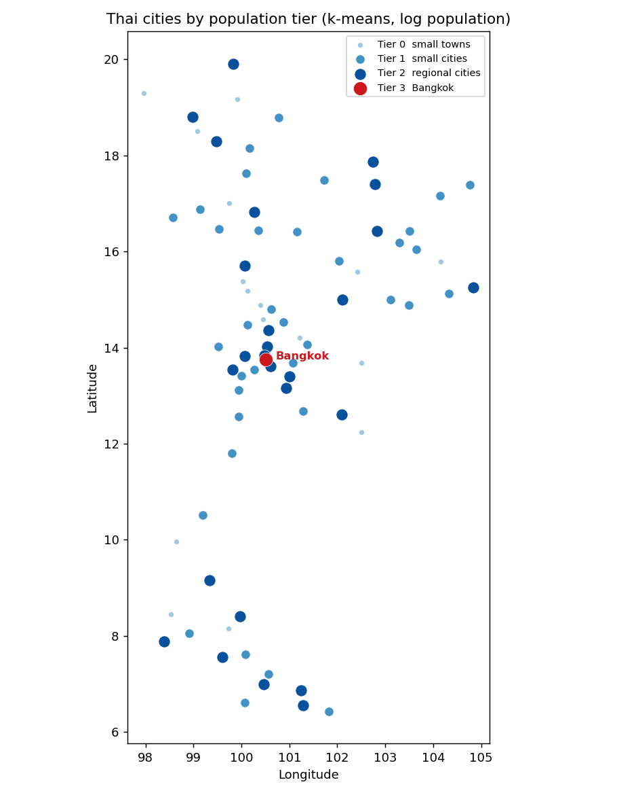

# Geospatial Machine Learning Portfolio

A progression of geospatial machine learning projects, moving from GIS
clustering to supervised modeling and raster GeoAI. This repository starts with
Project 01 and grows as each project is completed.

| #  | Project | Skill demonstrated | Tools | Status |
|----|---------|--------------------|-------|--------|
| 01 | Thai Cities Regional Clustering | Unsupervised clustering, GIS workflow | QGIS | Complete |
| 02 | Thai City Size Tiers | Python pipeline, scikit-learn | Python, pandas, scikit-learn, QGIS | Complete |
| 03 | Spatial Price Prediction | Supervised regression, model evaluation | Python, scikit-learn, QGIS | Planned |
| 04 | Raster Land Cover Classification | Applied GeoAI, raster ML | Python, GDAL, scikit-learn, QGIS | Planned |

---

## Project 01: Thai Cities Regional Clustering

Unsupervised k-means clustering of Thai cities that recovers the country's real
regions without being told where they are.

### Question
Do Thailand's cities fall into natural geographic groups, and can an
unsupervised algorithm find those groups on its own?

### Data
Natural Earth populated places (1:10m scale), filtered to Thailand. Fields used:
city name, longitude, latitude. Source: https://www.naturalearthdata.com/

### Method
K-means clustering with k = 4 on city coordinates, run with QGIS's built-in
K-means clustering tool (Processing Toolbox > Vector analysis). No labels were
provided. The algorithm grouped cities purely by spatial position.

### Result
The four clusters map cleanly onto Thailand's four conventional regions:

- North: Chiang Mai, Chiang Rai, Phayao
- Northeast / Isan: Ubon Ratchathani, Roi Et, Nakhon Phanom
- Central: Bangkok area, Saraburi, Nakhon Pathom
- South: Phuket, Hat Yai, Yala

### Key insight
An unsupervised algorithm reconstructed Thailand's regional geography with no
prior knowledge of the regions. Structure emerged from the data alone.

### Reproduce
1. Open `start.qgz` in QGIS.
2. Select the populated-places layer.
3. Processing Toolbox > K-means clustering, set clusters = 4, Run.
4. Style the output: Symbology > Categorized on `CLUSTER_ID` > Classify.

### Tools
QGIS 3.x, Natural Earth data.

---

## Project 02: Thai City Size Tiers

Where Project 01 clustered cities by *location*, this one clusters the same
cities by *population* — in Python this time — to see what size classes Thai
cities naturally fall into.

### Question
If you group Thai cities purely by population, how many distinct "size tiers"
appear, and how is the country's population distributed across them?

### Data
The same Natural Earth populated-places export as Project 01, filtered to
Thailand (79 cities) and included here as `populated-places.csv`. Field used:
`POP_MAX`. Source: https://www.naturalearthdata.com/

### Method
A small scikit-learn pipeline (`thai_city_tiers.py`):

1. Load the CSV with pandas, filter to Thailand, drop rows with no population.
2. Log-scale population (`log1p`) so Bangkok's millions don't dominate the
   distance math.
3. K-means with k = 4 on the single log-population feature.
4. Relabel the clusters smallest-to-largest so tier 0 = small towns and
   tier 3 = the largest city.
5. Write `thai_cities_tiers.csv` (reloadable into QGIS) and render the map.

### Result
Four clean population tiers emerge:

| Tier | Cities | Population range | Examples |
|------|--------|------------------|----------|
| 0 | 16 | 9,109 – 28,223 | Thung Song, Ranong, Aranyaprathet |
| 1 | 36 | 31,219 – 90,497 | Phetchaburi, Chumphon, Nan |
| 2 | 26 | 99,819 – 397,211 | Chiang Mai, Samut Prakan, Nakhon Ratchasima |
| 3 | 1 | 6,704,000 | Bangkok |

### Key insight
Tier 3 contains exactly one city: Bangkok. The algorithm, given no hints,
isolated Thailand's **primate city** — Bangkok is roughly 17× larger than the
next-biggest city, so it sits alone in its own size class while every other
city stacks into the three lower tiers. This urban-primacy pattern falls
straight out of an unsupervised model.

### Reproduce
1. `cd 02-thai-city-tiers`
2. `python thai_city_tiers.py`
3. Outputs: `thai_cities_tiers.csv` and `images/thai_city_tiers.png`.
4. Optional: load `thai_cities_tiers.csv` into QGIS as a delimited-text layer
   (X = `LONGITUDE`, Y = `LATITUDE`) and style Categorized on `tier`.

### Tools
Python 3, pandas, NumPy, scikit-learn, matplotlib; QGIS for optional display.
