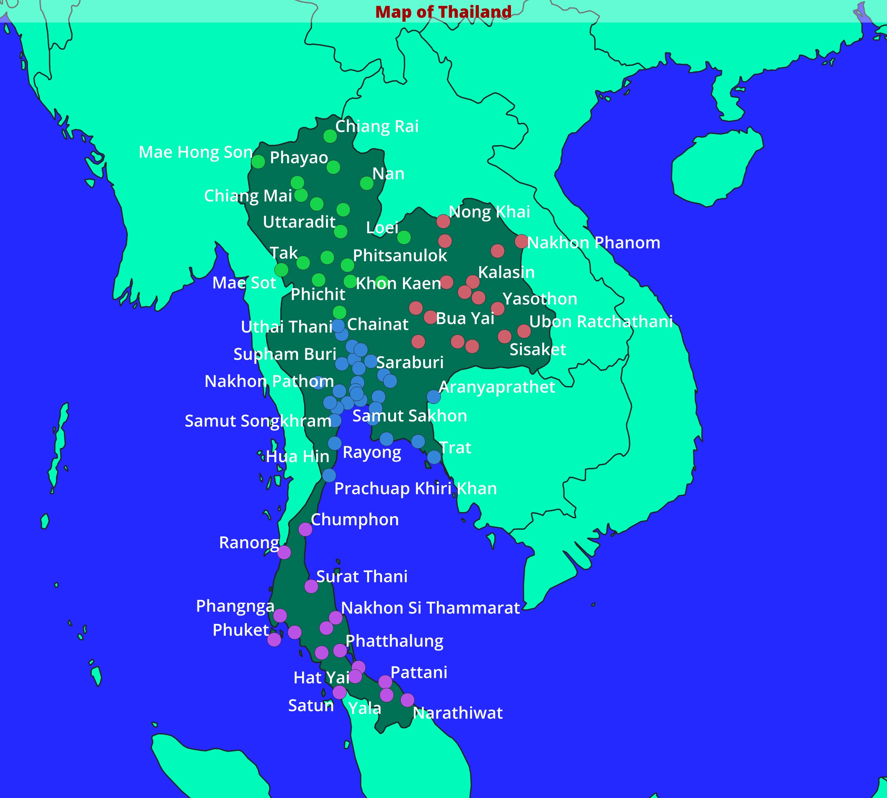

# Geospatial Machine Learning Portfolio

A progression of geospatial machine learning projects, moving from GIS
clustering to supervised modeling and raster GeoAI. This repository starts with
Project 01 and grows as each project is completed.

| #  | Project | Skill demonstrated | Tools | Status |
|----|---------|--------------------|-------|--------|
| 01 | Thai Cities Regional Clustering | Unsupervised clustering, GIS workflow | QGIS | Complete |
| 02 | Thai City Size Tiers | Python pipeline, scikit-learn | Python, pandas, scikit-learn, QGIS | Planned |
| 03 | Spatial Price Prediction | Supervised regression, model evaluation | Python, scikit-learn, QGIS | Planned |
| 04 | Raster Land Cover Classification | Applied GeoAI, raster ML | Python, GDAL, scikit-learn, QGIS | Planned |

---

## Project 01: Thai Cities Regional Clustering

Unsupervised k-means clustering of Thai cities that recovers the country's real
regions without being told where they are.

### Question
Do Thailand's cities fall into natural geographic groups, and can an
unsupervised algorithm find those groups on its own?

### Data
Natural Earth populated places (1:10m scale), filtered to Thailand. Fields used:
city name, longitude, latitude. Source: https://www.naturalearthdata.com/

### Method
K-means clustering with k = 4 on city coordinates, run with QGIS's built-in
K-means clustering tool (Processing Toolbox > Vector analysis). No labels were
provided. The algorithm grouped cities purely by spatial position.

### Result
The four clusters map cleanly onto Thailand's four conventional regions:

- North: Chiang Mai, Chiang Rai, Phayao
- Northeast / Isan: Ubon Ratchathani, Roi Et, Nakhon Phanom
- Central: Bangkok area, Saraburi, Nakhon Pathom
- South: Phuket, Hat Yai, Yala

### Key insight
An unsupervised algorithm reconstructed Thailand's regional geography with no
prior knowledge of the regions. Structure emerged from the data alone.

### Reproduce
1. Open `start.qgz` in QGIS.
2. Select the populated-places layer.
3. Processing Toolbox > K-means clustering, set clusters = 4, Run.
4. Style the output: Symbology > Categorized on `CLUSTER_ID` > Classify.

### Tools
QGIS 3.x, Natural Earth data.
